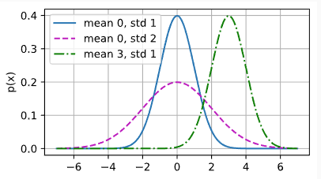
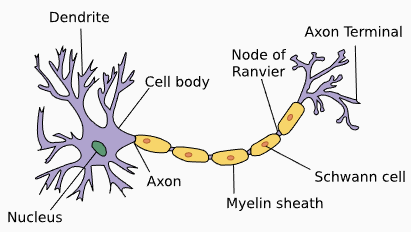

# Linear Regression

**Regression** is used to predict a specific numerical value. You use it when you want to answer "how much?" or "how many?"

**Common Examples**:

- Predicting home or stock prices.

- Forecasting retail demand.

- Estimating a patient's length of hospital stay.

    **Note**: Regression is different from classification, which predicts a category (like "spam" vs. "not spam") rather than a number.

**Key Terminology**

To build a model (e.g., predicting a house price based on its area and age), you need to understand these terms:

- Training Dataset: The collection of data used to teach the model.

- Example: A single row of data (one specific house sale). Also called a data point or sample.

- Label (Target): The value you want to predict (e.g., Price).

- Features (Covariates): The variables used to make the prediction (e.g., Area and Age).


## Basics
Linear regression is the simplest and most common tool for predicting numbers. It is built on two main assumptions:
1. **Linearity**: We assume the relationship between the features ($x$) and the target ($y$) is a straight line. In other words, $y$ is a weighted sum of the features.
2. **Noise**: We accept that real-world data isn't perfect. We assume the difference between the actual value and our prediction is just "noise" that follows a normal (Gaussian) distribution.

**Mathematical Notation**
To keep track of our data, we use specific symbols:
- $n$: The total number of examples (rows) in the dataset.
- $\mathbf{x}^{(i)}$: The $i^{\text{th}}$ sample (the whole row of features).
- $x_j^{(i)}$: The $j^{\text{th}}$ specific value within that $i^{\text{th}}$ sample (e.g., the "Area" of the 3rd house).
- $y^{(i)}$: The target label for the $i^{\text{th}}$ sample (e.g., the "Price" of the 3rd house).

**The Formula**
For a single prediction, the model looks like this:

$$\hat{y} = w_1x_1 + w_2x_2 + \dots + w_dx_d + b$$

- $w$ (Weights): Determine the influence of each feature.
- $b$ (Bias): The intercept or "starting point."

---

### The Linear Model

A model describes how to transform input features into a predicted target. In linear regression, we assume the target is simply a weighted sum of the inputs.

**1. The Basic Equation**

For a simple example like house prices:

$$\text{price} = w_{\text{area}} \cdot \text{area} + w_{\text{age}} \cdot \text{age} + b$$

**2. Vector & Matrix Notation**

In Machine Learning, we deal with many features, so we use Linear Algebra to keep things compact.

- For one example: We use a dot product between a weight vector $\mathbf{w}$ and a feature vector $\mathbf{x}$:
$$\hat{y} = \mathbf{w}^\top \mathbf{x} + b$$
- For the whole dataset:We use a Design Matrix ($\mathbf{X}$), where each row is an example and each column is a feature. The predictions for all examples ($\hat{\mathbf{y}}$) are calculated at once:
$$\hat{\mathbf{y}} = \mathbf{X} \mathbf{w} + b$$

**3. The Goal**

Our objective is to find the best parameters ($\mathbf{w}$ and $b$) that minimize the error between our predictions ($\hat{y}$) and the actual values ($y$).
    
**Real-world Note**: We don't expect the data to be perfectly linear because of "noise" (measurement errors or missing info), so our model aims to fit the data as closely as possible on average.

---

### **The Loss Function**

To improve our model, we need a way to measure how "wrong" its predictions are. We use a **Loss Function** to calculate the distance between the **real value** ($y$) and the **predicted value** ($\hat{y}$).
- **Goal**: A smaller loss means a better model. A loss of $0$ means a perfect prediction.
- **Common Choice**: For regression, we use the **Squared Error**.

    

**1. Loss for a Single Example**

For just one data point (like one house), the formula is:

$$l^{(i)}(\mathbf{w}, b) = \frac{1}{2} \left(\hat{y}^{(i)} - y^{(i)}\right)^2$$

**Breakdown of the Math**:
- $(\hat{y}^{(i)} - y^{(i)})$: The Error (difference between prediction and reality).$^2$ (Squared): This makes the error positive and penalizes large mistakes more heavily than small ones.
- $\frac{1}{2}$: A "convenience" number. When we do calculus later to update weights, the $2$ from the exponent cancels out with this $\frac{1}{2}$, making the math cleaner.

**2. Loss for the Whole Dataset**

To see how the model performs on all $n$ examples, we take the average of all individual losses. This is called the **Cost Function**:

$$L(\mathbf{w}, b) = \frac{1}{n} \sum_{i=1}^n \frac{1}{2}\left(\mathbf{w}^\top \mathbf{x}^{(i)} + b - y^{(i)}\right)^2$$

Breakdown of the Symbols:
- $\sum_{i=1}^n$: This means "sum up the losses for every example from 1 to $n$."
- $\frac{1}{n}$: This divides the total by the number of examples to get the average error.
- $\mathbf{w}^\top \mathbf{x}^{(i)} + b$: This is just the expanded version of our prediction $\hat{y}$.

**3. The Ultimate Goal**

In training, we want to find the specific weights ($\mathbf{w}^*$) and bias ($b^*$) that result in the lowest possible total loss. We write this as:

$$\mathbf{w}^*, b^* = \operatorname*{argmin}_{\mathbf{w}, b}\ L(\mathbf{w}, b)$$

**Translation**: "Find the $\mathbf{w}$ and $b$ that make the function $L$ reach its minimum value."

---

### The Analytic Solution

In most deep learning models, we have to find the best weights by trial and error (Gradient Descent). However, for **Linear Regression**, there is a special mathematical "shortcut" called an **Analytic Solution**. This allows us to calculate the perfect weights in one go using a single formula.

**1. Simplifying The Setup**

To make the math cleaner, we combine the bias ($b$) into the weight vector ($\mathbf{w}$).
- We do this by adding a new column to our data matrix ($\mathbf{X}$) filled entirely with 1s.
- Now, instead of $\hat{y} = \mathbf{X}\mathbf{w} + b$, we just write $\hat{y} = \mathbf{X}\mathbf{w}$.

**2. The Step-by-Step Math** 

We want to find the $\mathbf{w}$ that makes the difference between reality ($\mathbf{y}$) and our prediction ($\mathbf{X}\mathbf{w}$) as small as possible.

**Step A: The Objective** Minimize the total squared error:

$$\|\mathbf{y} - \mathbf{X}\mathbf{w}\|^2$$

**Step B: Find the "Bottom" of the Curve** To find the minimum, we take the derivative (the slope) with respect to $\mathbf{w}$ and set it to zero:

$$\partial_{\mathbf{w}} \|\mathbf{y} - \mathbf{X}\mathbf{w}\|^2 = 2 \mathbf{X}^\top (\mathbf{X} \mathbf{w} - \mathbf{y}) = 0$$

**Step C: Rearrange the Equation** By moving the terms around, we get:

$$\mathbf{X}^\top \mathbf{X} \mathbf{w} = \mathbf{X}^\top \mathbf{y}$$

**3. The Final Formula**

By isolating $\mathbf{w}$, we get the Optimal Solution ($\mathbf{w}^*$):

$$\mathbf{w}^* = (\mathbf X^\top \mathbf X)^{-1}\mathbf X^\top \mathbf{y}$$

What this means simply:
- $(\mathbf X^\top \mathbf X)^{-1}$: This is the "matrix version" of dividing. We are basically dividing the relationship of the features by the features themselves.
- **Result**: This formula gives you the exact weights that produce the lowest possible error for your training data.

**The Catch**: This only works if $(\mathbf X^\top \mathbf X)$ can be inverted (meaning your features aren't perfect copies of each other). Also, while this works for simple linear regression, Deep Learning is usually too complex for this shortcut, so we have to use "Stochastic Gradient Descent" instead.

---

### Minibatch Stochastic Gradient Descent (SGD)

Most deep learning models are too complex for a one-step "shortcut" formula. Instead, we use Gradient Descent: an iterative process where we slowly tweak the model's parameters to reduce the error (loss).

**Why use "Minibatches"?**

There are three ways to update a model, but the **Minibatch** approach is the "Goldilocks" solution (just right):
1. **Full Batch**: Looking at every single data point before making one tiny update. **(Too slow)**.
2. **Stochastic (Single Sample)**: Looking at only one data point at a time. **(Too erratic and inefficient for hardware)**.
3. **Minibatch**: Looking at a small group of data (usually 32 to 256 samples). **(Fast and stable)**.

**The Step-by-Step Math**

To update our weights ($\mathbf{w}$) and bias ($b$), we follow this logic:

**New Value = Old Value - (Learning Rate $\times$ Average Gradient of the Batch)**

**1. The General Update Rule**

$$(\mathbf{w},b) \leftarrow (\mathbf{w},b) - \frac{\eta}{|\mathcal{B}|} \sum_{i \in \mathcal{B}_t} \partial_{(\mathbf{w},b)} l^{(i)}(\mathbf{w},b)$$

- $\eta$ (Eta): The **Learning Rate**. A small number (like 0.01) that controls how big of a step we take.
- $|\mathcal{B}|$: The **Minibatch Size**. We divide by this to get the average error of the group
- $\partial$ **(Gradient)**: The direction and "steepness" of the error. We move in the opposite direction to go "downhill" toward lower loss.

**2. Detailed Expansion for Linear Regression**

If we plug in our specific linear formulas, the updates look like this:

**For Weights:**

$$\mathbf{w} \leftarrow \mathbf{w} - \frac{\eta}{|\mathcal{B}|} \sum_{i \in \mathcal{B}_t} \mathbf{x}^{(i)} \left(\mathbf{w}^\top \mathbf{x}^{(i)} + b - y^{(i)}\right)$$

**For Bias:**

$$b \leftarrow b - \frac{\eta}{|\mathcal{B}|} \sum_{i \in \mathcal{B}_t} \left(\mathbf{w}^\top \mathbf{x}^{(i)} + b - y^{(i)}\right)$$

**What is happening here?**
The term $(\mathbf{w}^\top \mathbf{x}^{(i)} + b - y^{(i)})$ is just the **difference** between our prediction and the actual label. We multiply this by the input features ($\mathbf{x}^{(i)}$), scale it by the learning rate, and subtract it from our current weights to make the model slightly more accurate.

**Key Concepts to Remember**
- **Hyperparameters**: Things like the **learning rate** ($\eta$) and **batch size** ($|\mathcal{B}|$). You have to choose these yourself; the model doesn't "learn" them automatically
- **Generalization**: Our real goal isn't just to have zero error on our study data (training set), but to make sure the model works on new data it has never seen before.

--- 

### Predictions (Inference)

Once we have trained our model and found the best parameters ($\hat{\mathbf{w}}$ and $\hat{b}$), we can use it to estimate the value of new, unseen data.

**How it Works**

If you have a new house with a specific **area** ($x_1$) and **age** ($x_2$), you simply plug those numbers into your learned formula:

$$\text{Predicted Price} = \hat{w}_1x_1 + \hat{w}_2x_2 + \hat{b}$$

**A Note on Terminology**

In your studies, you will often see two different words used for this phase:

1. **Prediction**: The term mostly used in standard Machine Learning. It means using the model to guess a specific value (like a house price).

2. **Inference**: The term often used by Deep Learning practitioners.

**Important distinction for your notes**: > In classical **Statistics**, "Inference" usually refers to understanding the relationship between variables (e.g., "How much does age actually affect price?"). In **Deep Learning**, "Inference" is simply the act of running data through the model to get a result. To avoid confusion with statisticians, it is often clearer to use the word Prediction.

---

## Vectorization for Speed
When training models, we need to process thousands of data points at once. To do this efficiently, we use **vectorization**.

Instead of using slow Python for-loops to process one number at a time, we use **linear algebra libraries** (like PyTorch or NumPy) to perform operations on entire arrays (vectors) at once. These libraries are optimized to run calculations in parallel, making them much faster.

### Code Example: For-Loop vs. Vectorization
Let's compare two ways of adding two 10,000-dimensional vectors.

**1. The Setup**
First, we create two vectors ($a$ and $b$) filled with 1s.

```python
import torch
import time

n = 10000
a = torch.ones(n)
b = torch.ones(n)
```

**2. The Slow Way (For-Loop)** This method adds the numbers one-by-one.

```python
c = torch.zeros(n)
t = time.time()
for i in range(n):
    c[i] = a[i] + b[i]
print(f'For-loop: {time.time() - t:.5f} sec')
```

**3. The Fast Way (Vectorized)** This method adds the entire vectors in a single operation.

```python
t = time.time()
d = a + b
print(f'Vectorized: {time.time() - t:.5f} sec')
```

**Why Vectorize?**
- **Speed**: Vectorized operations are often 10x to 100x faster because they use highly optimized C or CUDA code under the hood
- **Readability**: The code is shorter and looks more like the mathematical formulas.
- **Less Error**: You don't have to manage loop indices ($i$), which reduces the chance of bugs.

---

## The Connection: Normal Distribution & Squared Loss

Why do we use **Squared Error** as our loss function? It isn't just an arbitrary choice. There is a deep mathematical link between **Linear Regression** and the **Normal Distribution** (also called the Gaussian distribution).

**1. The Normal Distribution Formula**

The probability density of a normal distribution is defined by its **mean** ($\mu$) and **variance** ($\sigma^2$):

$$p(x) = \frac{1}{\sqrt{2 \pi \sigma^2}} \exp\left(-\frac{1}{2 \sigma^2} (x - \mu)^2\right)$$

**Math Breakdown:**
- $x$: The data point we are evaluating.
- $\mu$ (mu): The average (center of the bell curve).
- $\sigma^2$ (sigma squared): The variance (how spread out the curve is).
- $\frac{1}{\sqrt{2 \pi \sigma^2}}$: A constant that ensures the total probability equals 1.
- $\exp(\dots)$: The natural exponential function ($e$ raised to a power).
- $(x - \mu)^2$: The squared distance from the mean. This ensures the value is always positive and penalizes outliers.

**2. Visualizing with Code**

Changing the **mean** shifts the curve left or right. Changing the **standard deviation** ($\sigma$) makes the curve taller/skinny or shorter/wide.

```python
import numpy as np
import math

def normal(x, mu, sigma):
    # Calculate the constant part
    p = 1 / math.sqrt(2 * math.pi * sigma**2)
    # Calculate the exponential part
    return p * np.exp(-0.5 * (x - mu)**2 / sigma**2)

# Example usage for a range of values
x = np.arange(-7, 7, 0.01)
params = [(0, 1), (0, 2), (3, 1)] # (mean, std) pairs
```



**3. Why Squared Loss? (The Logic)**

We assume that the actual labels ($y$) in our data are created by a linear model plus some random noise ($\epsilon$):

$$y = \mathbf{w}^T \mathbf{x} + \epsilon$$

If we assume the noise $\epsilon$ follows a normal distribution with a mean of $0$, then the probability of seeing a specific $y$ given our inputs $\mathbf{x}$ is:

$$P(y \mid \mathbf{x}) = \frac{1}{\sqrt{2 \pi \sigma^2}} \exp\left(-\frac{1}{2 \sigma^2} (y - \mathbf{w}^\top \mathbf{x} - b)^2\right)$$

**Maximum Likelihood Estimation (MLE)**

To find the best weights ($\mathbf{w}$) and bias ($b$), we want to maximize the probability of the whole dataset. This is the **Maximum Likelihood Principle**:

$$P(\mathbf y \mid \mathbf X) = \prod_{i=1}^{n} p(y^{(i)} \mid \mathbf{x}^{(i)})$$

To make the math easier, we take the Negative Log of this probability (Negative Log-Likelihood):

$$-\log P(\mathbf y \mid \mathbf X) = \sum_{i=1}^n \frac{1}{2} \log(2 \pi \sigma^2) + \frac{1}{2 \sigma^2} \left(y^{(i)} - \mathbf{w}^\top \mathbf{x}^{(i)} - b\right)^2$$

**The Result**:
If we assume $\sigma$ is constant, the only part of this formula that changes when we tweak $\mathbf{w}$ and $b$ is the last part:

$$\sum_{i=1}^n (y^{(i)} - \mathbf{w}^\top \mathbf{x}^{(i)} - b)^2$$

This is exactly the **Sum of Squared Errors!** This proves that minimizing squared error is the same as finding the most likely parameters for a model with normal noise.

---

## Linear Regression as a Neural Network
In deep learning, we can view Linear Regression as the simplest possible neural network: **a single-layer fully connected network**.

**1. The Network Structure**


Imagine a diagram where every input feature is a "node" (neuron) that connects directly to the output.
- **Input Layer**: These are your features ($x_1, x_2, \ldots, x_d$). The number of inputs $d$ is called the dimensionality.
- **Output Layer**: This is the single neuron ($o_1$) that produces our prediction.
- **Connectivity**: Every input is connected to the output. These connections represent the weights.

**2. The Formula (Neural Perspective)**

The way a neuron computes a result is exactly like our linear regression formula:

$$o_1 = w_1 x_1 + w_2 x_2 + \dots + w_d x_d + b$$

**Detailed Formula Breakdown**:
- $x_i$ **(Inputs)**: The data being fed into the neuron.
- $w_i$ **(Weights)**: The strength of the connection. In biology, this is like a synapse determining how much a signal influences the next cell.
- $b$ **(Bias)**: An internal offset that allows the neuron to fire even when inputs are low.
- $o_1$ **(Output)**: The final weighted sum sent to the next part of the system.

**3. The Biological Inspiration**



The concept of artificial neural networks was inspired by how biological neurons function in the brain

| Artificial Component | Biological Equivalent | Function |
|----------------------|----------------------|----------|
| Input (xᵢ)           | Dendrites            | Receives signals from other neurons or sensors |
| Weights (wᵢ)         | Synapses             | Determines the strength or impact of the incoming signal |
| Summation + Bias     | Cell Nucleus         | Aggregates all incoming signals into one value |
| Output (o₁)          | Axon                 | Sends the processed signal to muscles or other neurons |

## Summary

### 1. What is Linear Regression?
Linear Regression is a method used to **predict specific numerical** values (answering "how much?").
- **Examples**: Predicting house prices, stock values, or hospital stay duration.
- **Key Terms**:
    - **Label** ($y$): The answer we want to predict (e.g., Price)
    - **Features** ($\mathbf{x}$): The input data used to make the prediction (e.g., Area, Age).
    - **Weights** ($\mathbf{w}$): How important each feature is.
    - **Bias** ($b$): The baseline or intercept.

### 2. The Model
We assume the relationship between inputs and the target is a straight line plus some random noise.
- **Scalar Formula**: $\hat{y} = w_1x_1 + \dots + w_dx_d + b$
- **Vector Formula (Standard)**: $\hat{y} = \mathbf{w}^\top \mathbf{x} + b$
- **Matrix Formula (Whole Dataset)**: $\hat{\mathbf{y}} = \mathbf{X} \mathbf{w} + b$

### 3. The Loss Function (Measuring Error)
We need to measure how "wrong" our predictions are to improve the model.
- **Metric**: **Squared Error**. We square the difference between the prediction and the truth.
- **Loss for one example**:

$$l^{(i)}(\mathbf{w}, b) = \frac{1}{2} \left(\hat{y}^{(i)} - y^{(i)}\right)^2$$

- **Goal**: Find the weights $\mathbf{w}$ and bias $b$ that minimize this error across the entire dataset.

### 4. Optimization: How to find the best weights?
There are two ways to solve for the best parameters:

**A. The Analytic Solution (The "Shortcut")**

A mathematical formula that calculates the perfect weights instantly
- **Formula**: $\mathbf{w}^* = (\mathbf X^\top \mathbf X)^{-1}\mathbf X^\top \mathbf{y}$
- **Pros**: Exact answer.
- **Cons**: Very slow or impossible for large/complex datasets (requires inverting a massive matrix).

**B. Stochastic Gradient Descent (SGD) (The "Deep Learning Way")**

An iterative process where we tweak weights step-by-step.
1. **Minibatch**: We take a small group of data (e.g., 32 examples)
2. **Gradient**: We calculate the direction of the error.
3. **Update**: We move the weights slightly in the opposite direction to reduce error.
    - **Update Rule**: $\mathbf{w} \leftarrow \mathbf{w} - \eta \cdot \text{Gradient}$
    - $\eta$ **(Learning Rate)**: Controls the step size.

### 5. Implementation: Vectorization
We never use ``for-loops`` to process data one by one. It is too slow.
- **Vectorization**: Using Linear Algebra libraries (like NumPy or PyTorch) to process entire matrices of data in parallel.
- **Benefit**: Massive speed improvements (often 100x faster).

### 6. The "Why": Connection to Normal Distribution
Why do we use Squared Error?
- We assume the "noise" in our data follows a **Normal (Gaussian) Distribution**.
- **Maximum Likelihood Estimation (MLE)**: If you try to find the most probable parameters for data with Gaussian noise, the math simplifies directly into minimizing the squared error.

### 7. Neural Network Perspective
Linear Regression is effectively the simplest possible Neural Network.
- **Architecture**: A **Single-Layer Fully Connected Network**.
- **Structure**:
    - **Input Layer**: The features ($x$).
    - **Connections**: The weights ($w$).
    - **Output Node**: The summation + bias ($o$).

This architecture mimics the biological neuron, where dendrites receive signals (inputs), synapses weight them, and the cell nucleus sums them up to fire an output.