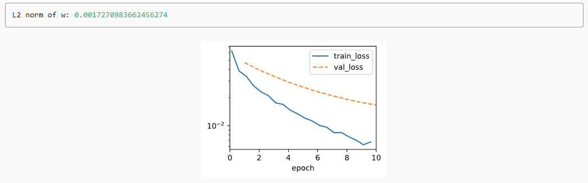

# Weight Decay ($\ell_2$ Regularization)

## 1. Introduction: The Problem of Overfitting

When a model is too complex (e.g., too many features/parameters) relative to the amount of training data, it memorizes the data (including noise) rather than learning the pattern.

- **Solution**: We cannot always get more data. Instead, we use **Regularization** to constrain the model's complexity
- **Concept**: Rather than removing features, **Weight Decay** restricts the values the parameters can take, keeping them small (close to zero).

2. Mathematical FoundationWe measure complexity using the norm of the weight vector. The most common method is $\ell_2$ **Regularization**.

### A. The Penalized Loss Function
We modify the original loss function (like MSE) by adding a penalty term:

$$L(\mathbf{w}, b) + \frac{\lambda}{2} \|\mathbf{w}\|^2$$

- $L(\mathbf{w}, b)$: The original loss (e.g., Mean Squared Error).
- $\lambda$ (lambda): The **regularization constant**.
    - If $\lambda = 0$: No regularization (standard training).
    - If $\lambda > 0$: We force weights to be smaller.
- $\|\mathbf{w}\|^2$: The squared $\ell_2$ norm ($\sum w_i^2$).
- $\frac{1}{2}$: Added for convenience so it cancels out when taking the derivative ($2 \times \frac{1}{2} = 1$).

### B. The Update Rule (Why it's called "Decay")
When optimizing via Stochastic Gradient Descent (SGD), the update step becomes:

$$\mathbf{w} \leftarrow \left(1- \eta\lambda \right) \mathbf{w} - \eta \nabla 
L$$

- $\eta$ (eta): Learning rate.
- The term $(1- \eta\lambda)\mathbf{w}$ shows that we shrink (decay) the current weights by a factor before making the standard update

## 3. Dataset Generation
To demonstrate overfitting, we generate a synthetic dataset with high dimensionality ($d=200$) but very few training examples ($n=20$).**Formula:**

$$y = 0.05 + \sum_{i = 1}^d 0.01 x_i + \epsilon, \quad \epsilon \sim \mathcal{N}(0, 0.01^2)$$

```python
import torch
from torch import nn

# Import our OOD framework components
from .."2.2 Object-Oriented Design for Implementation".code import DataModule, Trainer
from .."2.4 Linear Regression Implementation from Scratch".code import LinearRegressionScratch
from .."2.5 Concise Implementation of Linear Scratch" import LinearRegression

class Data(DataModule):
    def __init__(self, num_train, num_val, num_inputs, batch_size):
        self.save_hyperparameters()
        n = num_train + num_val
        self.X = torch.randn(n, num_inputs)
        noise = torch.randn(n, 1) * 0.01
        w, b = torch.ones((num_inputs, 1)) * 0.01, 0.05
        self.y = torch.matmul(self.X, w) + b + noise

    def get_dataloader(self, train):
        i = slice(0, self.num_train) if train else slice(self.num_train, None)
        return self.get_tensorloader([self.X, self.y], train, i)
```

## 4. Implementation from Scratch
We implement the regularization manually by adding the squared norm to the loss function.

### A. Defining the Penalty
Sum of squared weights divided by 2.

```Python
def l2_penalty(w):
    return (w ** 2).sum() / 2
```

### B. Defining the Model
We inherit from our previous `LinearRegressionScratch` and override the `loss` method to include the penalty.

```Python
class WeightDecayScratch(LinearRegressionScratch):
    def __init__(self, num_inputs, lambd, lr, sigma=0.01):
        super().__init__(num_inputs, lr, sigma)
        self.save_hyperparameters()

    def loss(self, y_hat, y):
        # Original Loss + Lambda * L2 Penalty
        return (super().loss(y_hat, y) +
                self.lambd * l2_penalty(self.w))
```

### C. Training & Comparison
We set up a helper function to train the model and check the L2 norm of the final weights.

```Python
data = Data(num_train=20, num_val=100, num_inputs=200, batch_size=5)
trainer = Trainer(max_epochs=10)

def train_scratch(lambd):
    model = WeightDecayScratch(num_inputs=200, lambd=lambd, lr=0.01)
    model.board.yscale='log'
    trainer.fit(model, data)
    print('L2 norm of w:', float(l2_penalty(model.w)))
```

**Scenario 1: No Regularization** ($\lambda = 0$)Result: Severe overfitting. Training error decreases, but validation error remains high.

```Python
train_scratch(0)
```


**Scenario 2: With Weight Decay** ($\lambda = 3$)Result: Better generalization. The validation error decreases (gap narrows), and the norm of $\mathbf{w}$ is much smaller.

```Python
train_scratch(3)
```


### 5. Concise Implementation (PyTorch)
Deep learning frameworks allow us to apply weight decay directly within the **Optimizer**, which is computationally faster.

**Key difference**: We pass ``weight_decay`` to ``torch.optim.SGD``. We apply it to weights (``net.weight``) but typically not to the bias (``net.bias``).

```Python
class WeightDecay(LinearRegression):
    def __init__(self, wd, lr):
        super().__init__(lr)
        self.save_hyperparameters()
        self.wd = wd

    def configure_optimizers(self):
        return torch.optim.SGD([
            {'params': self.net.weight, 'weight_decay': self.wd},
            {'params': self.net.bias}], lr=self.lr)
```
**Training:**

```Python
model = WeightDecay(wd=3, lr=0.01)
model.board.yscale='log'
trainer.fit(model, data)

print('L2 norm of w:', float(l2_penalty(model.get_w_b()[0])))
```

**Summary**
- **Weight Decay** ($\ell_2$): Adds $\frac{\lambda}{2} \|\mathbf{w}\|^2$ to the loss function.
- **Effect**: Forces weights to remain small, distributing influence across features rather than relying heavily on a few.
- **Result**: Reduces variance (overfitting) at the cost of slight bias (underfitting training data slightly), leading to better validation performance.