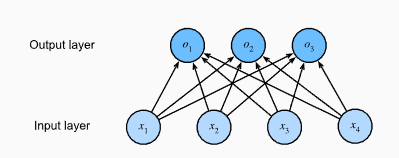

# Softmax Regression 
## Classification
### 1. Regression vs. Classification
Before building the model, it is important to distinguish the type of problem we are solving.

- **Regression**: Answers "How much?" or "How many?"
    - Examples: Predicting house prices, temperature, or duration of a hospital stay.
    - Target: Continuous numbers.
- **Classification**: Answers "Which category?"
    - Examples: Is this email spam? Is this image a cat or a dog
    - Target: Discrete categories (classes).
    
    **Note**: **Multi-label classification** occurs when one input can belong to multiple categories simultaneously (e.g., a news article about both "Business" and "Space").
### 2. Representing Labels (One-Hot Encoding)
In classification, we don't usually use raw numbers (1, 2, 3) for classes because there is no natural ordering (e.g., "Dog" is not greater than "Cat"). Instead, we use One-Hot Encoding.

We create a vector with a length equal to the number of categories. We set the correct category to 1 and all others to 0.

**Example**: If we have 3 categories: Cat, Chicken, Dog.
- Cat = $(1, 0, 0)$
- Chicken = $(0, 1, 0)$
- Dog = $(0, 0, 1)$

$$y \in \{(1, 0, 0), (0, 1, 0), (0, 0, 1)\}$$

### 3. The Linear Model
To classify data into multiple categories, we need multiple outputs (one output score per category). This is a **fully connected (dense) layer**.

If we have **4 inputs** ($x_1, x_2, x_3, x_4$) and **3 outputs** ($o_1, o_2, o_3$), we need a weight matrix and bias vector.

**Scalar Equations**:Each output is a weighted sum of inputs plus a bias:

$$o_1 = x_1 w_{11} + x_2 w_{12} + x_3 w_{13} + x_4 w_{14} + b_1$$
$$o_2 = x_1 w_{21} + x_2 w_{22} + x_3 w_{23} + x_4 w_{24} + b_2$$
$$o_3 = x_1 w_{31} + x_2 w_{32} + x_3 w_{33} + x_4 w_{34} + b_3$$



**Matrix Notation**:To make this cleaner, we represent weights as a Matrix $\mathbf{W}$ and biases as a vector $\mathbf{b}$:

$$\mathbf{o} = \mathbf{W} \mathbf{x} + \mathbf{b}$$

### 4. The Softmax Function
The raw outputs from the linear model ($\mathbf{o}$) are just arbitrary numbers. They are not probabilities because:
1. They can be negative.
2. They don't sum up to 1.

To fix this, we apply the **Softmax** function. This "squishes" the outputs so they are all positive and sum to 1.

**The Formula**:

$$\hat{y}_i = \frac{\exp(o_i)}{\sum_j \exp(o_j)}$$

**How it works**:
1. **Exponentiate**: Calculate $\exp(o_i)$ for every output. This makes all values positive.
2. **Normalize**: Divide each value by the sum of all values. This ensures they sum to 1.

The category with the highest score is our prediction:

$$\operatorname*{argmax}_j \hat y_j = \operatorname*{argmax}_j o_j$$

### 5. Vectorization (Efficiency)
In practice, we don't process one image at a time. We process a **minibatch** of data (e.g., $n$ examples at once) for efficiency.
- $\mathbf{X}$: Input batch (shape $n \times d$)
- $\mathbf{W}$: Weights (shape $d \times q$)
- $\mathbf{b}$: Bias (shape $1 \times q$)

**The Vectorized Equation**:

$$\mathbf{O} = \mathbf{X} \mathbf{W} + \mathbf{b}$$

$$\hat{\mathbf{Y}} = \mathrm{softmax}(\mathbf{O})$$

### Conceptual Code Implementation:

```python
def softmax(O):
    # 1. Exponentiate all elements (O represents the linear outputs)
    O_exp = torch.exp(O)
    
    # 2. Calculate the sum of each row (partition function)
    partition = O_exp.sum(axis=1, keepdims=True)
    
    # 3. Divide to normalize
    return O_exp / partition  # The result is Y_hat

# The full forward pass
# X is our batch of images
# W is our weight matrix
# b is our bias vector
O = torch.matmul(X, W) + b
Y_hat = softmax(O)
```

## Loss Function

### 1. The Likelihood Principle (The Foundation)
We want the model to assign high probability to the correct class. If we have a dataset, the probability of the entire dataset is the **product** of the probabilities of each individual example.

**The Formula**:

$$P(\mathbf{Y} \mid \mathbf{X}) = \prod_{i=1}^n P(\mathbf{y}^{(i)} \mid \mathbf{x}^{(i)})$$

- **Problem**: Multiplying many probabilities (which are $<1$) results in numbers so small that computers treat them as zero (underflow).
- **Solution**: We take the **Negative Logarithm**. This turns products into sums (easier to calculate) and turns maximization into minimization (easier to optimize).

**The Log-Likelihood**:

$$-\log P(\mathbf{Y} \mid \mathbf{X}) = \sum_{i=1}^n -\log P(\mathbf{y}^{(i)} \mid \mathbf{x}^{(i)})$$

### 2. Cross-Entropy Loss (The Standard Formula)

This is the loss function for a single example. It measures the difference between the true distribution $\mathbf{y}$ and the predicted distribution $\hat{\mathbf{y}}$.

**The Formula**:

$$l(\mathbf{y}, \hat{\mathbf{y}}) = - \sum_{j=1}^q y_j \log \hat{y}_j$$
- $y_j$: The actual label (0 or 1).
- $\hat{y}_j$: The predicted probability (from Softmax).
- **Key**: Since $y$ is a one-hot vector (only one $1$, the rest $0$), the sum collapses to just the log of the correct class.

### 3. Softmax + Cross-Entropy (The Calculation Formula)
When we actually compute this, we combine the Softmax formula into the **Loss** formula. This is mathematically efficient.

**Recall Softmax**: $\hat{y}_j = \frac{\exp(o_j)}{\sum_k \exp(o_k)}$

If we plug this into the loss formula, we get a specific derived form that is used in deep learning frameworks (like PyTorch's ``CrossEntropyLoss``).

**The Derivation**:

$$\begin{aligned}
l(\mathbf{y}, \hat{\mathbf{y}}) &= - \sum_{j=1}^q y_j \log \left( \frac{\exp(o_j)}{\sum_{k=1}^q \exp(o_k)} \right) \\
&= \sum_{j=1}^q y_j \left( \log \sum_{k=1}^q \exp(o_k) - \log \exp(o_j) \right) \\
&= \underbrace{\log \sum_{k=1}^q \exp(o_k)}_{\text{Log-Sum-Exp term}} - \underbrace{\sum_{j=1}^q y_j o_j}_{\text{Linear term}}
\end{aligned}$$

**Why this matters**:
1. **Log-Sum-Exp**: This term handles the normalization logarithmically to prevent overflow.
2. **Linear Term**: This part is simple multiplication.

### 4. The Gradient (The Update Rule)
To train the network, we need the derivative (gradient) of the loss with respect to the inputs $o_j$. This tells us how to change the weights.

**The Formula**:

$$\partial_{o_j} l(\mathbf{y}, \hat{\mathbf{y}}) = \frac{\exp(o_j)}{\sum_{k=1}^q \exp(o_k)} - y_j$$

**Simplified**:

$$\partial_{o_j} l = \hat{y}_j - y_j$$

**Interpretation**:The gradient is simply: **(Predicted Probability) $-$ (Actual Label)**.
- If you predicted 0.9 and the label is 1.0, the gradient is $-0.1$
- This simplicity is why Softmax + Cross-Entropy are the standard choice for classification.

### 5. Code Implementation

**Code Implementation**
```Python
import numpy as np

def stable_softmax_cross_entropy(O, y):
    """
    Computes Cross-Entropy Loss explicitly using the Log-Sum-Exp trick 
    derived in Section 3.
    
    Parameters:
    O (np.array): Raw output logits from the linear layer (shape: 1 x classes)
    y (np.array): One-hot encoded truth vector (shape: 1 x classes)
    """
    
    # 1. Compute the Log-Sum-Exp term
    # We use a max subtraction trick for numerical stability (prevent overflow)
    c = np.max(O)
    log_sum_exp = c + np.log(np.sum(np.exp(O - c)))
    
    # 2. Compute the Linear term (Sum of y_j * o_j)
    linear_term = np.sum(y * O)
    
    # 3. Combine them (Formula from Section 3)
    loss = log_sum_exp - linear_term
    
    return loss

def gradient_calculation(O, y):
    """
    Computes the gradient (derivative) derived in Section 4.
    """
    
    # 1. Compute Softmax (y_hat)
    exp_O = np.exp(O - np.max(O))
    y_hat = exp_O / np.sum(exp_O)
    
    # 2. Compute Gradient: y_hat - y (Formula from Section 4)
    gradient = y_hat - y
    
    return gradient

# --- Example Data ---
# Raw logits (O) for 3 classes: [Cat, Chicken, Dog]
logits = np.array([2.0, 1.0, 0.1]) 

# True label (y): Class 0 (Cat)
true_label = np.array([1, 0, 0])

# Calculate Loss
loss_val = stable_softmax_cross_entropy(logits, true_label)
print(f"Loss: {loss_val:.4f}")

# Calculate Gradient
grad_val = gradient_calculation(logits, true_label)
print(f"Gradient: {grad_val}")
# Notice the gradient for the correct class (index 0) will be negative,
# meaning we need to increase that weight.
```

##  Information Theory Basics

### 1. What is Information Theory?
Information theory is the science of quantifying data. In Deep Learning, we use it to measure how "surprised" our model is by the correct answer.
- **Goal**: To transmit (or predict) data using the fewest possible "bits" or "nats".
- **Intuition**:
    - **Predictable events** (e.g., "The sun will rise tomorrow") contain low information. We aren't surprised, so we don't need many bits to tell someone about it.
    - **Rare events** (e.g., "A meteorite landed in my garden") contain high information. We are very surprised, so we need more bits to describe it.

### 2. Entropy (The Baseline)
Entropy ($H$) measures the minimum amount of information needed to encode a distribution $P$. It represents the inherent uncertainty in the data itself.

**The Formula**:

$$H[P] = \sum_j - P(j) \log P(j)$$
- $P(j)$: The true probability of event $j$.
- **Unit**: If we use log base 2, the unit is bits. If we use natural log (base $e$), the unit is nats ($1 \text{ nat} \approx 1.44 \text{ bits}$).

### 3. Surprisal (Self-Information)
How do we measure information for a single event? We use Surprisal.If an event $j$ has probability $P(j)$, its surprisal is:

**The Formula**:

$$\text{Surprisal}(j) = -\log P(j) = \log \frac{1}{P(j)}$$
- **High Probability** ($P \approx 1$): Low surprisal (Log 1 = 0).
- **Low Probability** ($P \approx 0$): High surprisal (Log 0 $\to \infty$).

**Think of it this way**: If your model is 100% sure an image is a dog ($P=1$), and it is a dog, the surprisal is 0. The model learned nothing new. If the model thought it was a cat ($P \approx 0$) but it turns out to be a dog, the surprisal is massive.

### 4. Cross-Entropy Revisited
Cross-Entropy connects our model's predictions ($Q$) to the real world ($P$).
- $P$: The True distribution (the labels).
- $Q$: The Predicted distribution (our model's output).

**The Formula**:

$$H(P, Q) = \sum_j - P(j) \log Q(j)$$

**Why do we minimize this?**
- We want our predicted distribution $Q$ to match the true distribution $P$.
- The lowest possible cross-entropy occurs when $P = Q$.
- When $P=Q$, the Cross-Entropy equals the Entropy ($H(P)$). You literally cannot do better than the truth. 

**Code Implementation**

```Python
import numpy as np

def calculate_surprisal(probability):
    """
    Calculates the surprisal (information content) of a single event.
    Formula: -log(p)
    """
    return -np.log(probability)

def calculate_entropy(probabilities):
    """
    Calculates the Entropy of a distribution P.
    Formula: sum(-p * log(p))
    """
    # Filter out 0 probabilities to avoid log(0) error
    probabilities = probabilities[probabilities > 0]
    return -np.sum(probabilities * np.log(probabilities))

def calculate_cross_entropy(P, Q):
    """
    Calculates Cross-Entropy between Truth (P) and Prediction (Q).
    Formula: sum(-p * log(q))
    """
    # P is usually one-hot in classification (e.g., [1, 0, 0])
    # Q is the model's softmax output (e.g., [0.7, 0.2, 0.1])
    return -np.sum(P * np.log(Q))

# --- Example Usage ---

# 1. Surprisal
# High prob event (0.99) -> Low surprisal
print(f"Surprisal (Prob=0.99): {calculate_surprisal(0.99):.4f} nats")
# Low prob event (0.01) -> High surprisal
print(f"Surprisal (Prob=0.01): {calculate_surprisal(0.01):.4f} nats")

# 2. Entropy vs Cross-Entropy
# True Distribution P (One-Hot for 'Cat')
P = np.array([1.0, 0.0, 0.0])

# Perfect Prediction Q_perfect (Model is 100% sure it's a Cat)
Q_perfect = np.array([1.0, 1e-9, 1e-9]) # using epsilon for log safety

# Bad Prediction Q_bad (Model thinks it's a Dog)
Q_bad = np.array([0.1, 0.2, 0.7])

print("-" * 30)
print(f"Entropy of Truth P: {calculate_entropy(P):.4f} (Always 0 for one-hot)")
print(f"Cross-Entropy (Perfect Model): {calculate_cross_entropy(P, Q_perfect):.4f}")
print(f"Cross-Entropy (Bad Model): {calculate_cross_entropy(P, Q_bad):.4f}")

# Key Takeaway: The Bad Model has high Cross-Entropy (High Surprisal).
# We train the model to lower this number.
```
## Summary of Softmax Regression

### 1. The Big Picture

We switched from **Regression** (predicting numbers like price) to **Classification** (predicting categories like Cat/Dog).
- **Input**: Features (e.g., pixels of an image).
- **Output**: Probabilities for each category (must sum to 1).

### 2. The Architecture (Linear Layer)
We use a **Fully Connected Layer** where every input is connected to every output.
- **Formula**: $\mathbf{o} = \mathbf{W} \mathbf{x} + \mathbf{b}$
- **Shape**: If we have 4 inputs and 3 classes, Weights $\mathbf{W}$ is $4 \times 3$.
- **Raw Output**: These are called logits ($\mathbf{o}$). They can be negative or greater than 1.

### 3. The Activation (Softmax)
We need to turn raw logits into valid probabilities.

**Function**: Softmax.
- **Formula**: $\hat{y}_i = \frac{\exp(o_i)}{\sum_j \exp(o_j)}$
- **Result**: All outputs are positive and sum to $1.0$.

### 4. The Loss Function (Cross-Entropy)
We need to measure the error between our prediction ($\hat{\mathbf{y}}$) and the truth ($\mathbf{y}$).
- **Method**: **Maximum Likelihood Estimation**.
- **Formula**: $L = -\sum y_i \log(\hat{y}_i)$
- **Simplified**: Since truth is One-Hot (only one 1), Loss is just $-\log(\text{Predicted Probability of Correct Class})$.
- **Goal**: Minimize this loss (which maximizes the likelihood of the correct class).

### 5. The Update (Gradient Descent)
We calculate the derivative of the loss to update the weights
- **Gradient**: $\frac{\partial L}{\partial o} = \hat{\mathbf{y}} - \mathbf{y}$
- **Interpretation**: The error is simply (Prediction - Truth).

### 6. Information Theory Connection
- **Entropy**: The minimum bits needed to encode information
- **Surprisal**: High surprise = High information (Rare events)
- **Cross-Entropy**: Measures the difference (bits) between the True distribution and our Predicted distribution. Minimizing loss = Minimizing surprise.