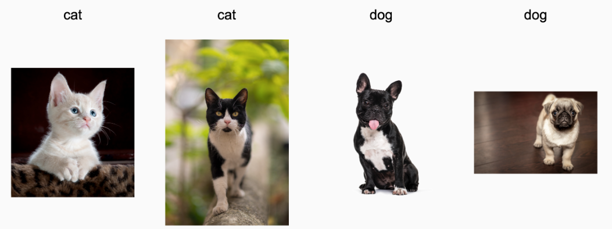
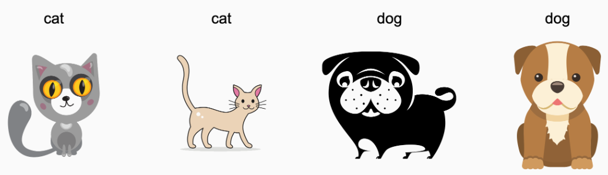
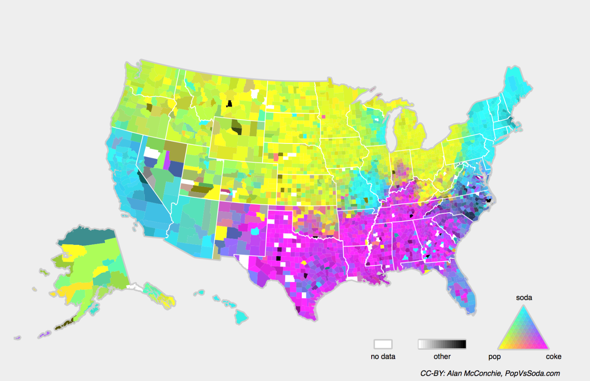

# Environment and Distribution Shift

## Types of Distribution Shift

### 1. The Core Problem: Environment and Distribution Shift
Machine learning models often fail in the real world because developers ignore where data comes from and how model predictions affect the environment.

- **The Issue**: A model might have high accuracy on a test set but fail in deployment because the **data distribution shifts** (the real world changes).
- **The Feedback Loop**: Deploying a model can actually change the data distribution.
    - Example: A bank notices people wearing "Oxford" shoes pay back loans, while "sneaker" wearers default. The bank starts giving loans only to Oxford wearers. Result: Everyone starts buying Oxfords to get loans, regardless of their actual creditworthiness. The model breaks because the correlation (shoes $\to$ repayment) no longer holds.

### 2. General Distribution Shift Setup
To understand how data changes, we compare two distributions:
1. **Training Distribution** ($p_S$): The data we learned from ($S$ for Source).
2. **Test Distribution** ($p_T$): The data we encounter in the real world ($T$ for Target).

**The Mathematical Problem**:We assume training data is sampled from $p_S(\mathbf{x},y)$ and test data from $p_T(\mathbf{x},y)$. If we make no assumptions about how these two relate, learning is impossible.
- Pathological Case: The input distribution $p(\mathbf{x})$ could stay the same, but the labels flip completely (e.g., all cats become dogs). Without assumptions, a model cannot detect this.

### 3. Types of Shift
We categorize shifts based on what changes and what stays the same.

**A. Covariate Shift**
This is the most widely studied type of shift.

- **Definition**: The distribution of inputs (features) changes, but the relationship between inputs and labels stays the same.
- **The Math**:
    - $P(y \mid \mathbf{x})$ remains **fixed** (The "Labeling Function").
    - $P(\mathbf{x})$ **changes** (The distribution of covariates).  
- **When to assume this**: When inputs cause labels ($\mathbf{x} \to y$).
- **Example**:
    - **Training**: Real photos of cats and dogs.
    - **Testing**: Cartoons of cats and dogs.
    - The visual features ($\mathbf{x}$) have shifted (photo vs. cartoon), but the definition of a cat ($y$) hasn't changed.

 
**Figure 1: Training data (Real Photos)**

**Figure 2: Test data (Cartoons)**

**B. Label Shift**

This is the converse of covariate shift.
- **Definition**: The distribution of labels changes, but the class-conditional distribution stays the same.
- **The Math**:
    - $P(\mathbf{x} \mid y)$ remains fixed.
    - $P(y)$ changes (The Label Marginal).
- **When to assume this**: When labels cause inputs ($y \to \mathbf{x}$).
- **Example**:
    - Predicting diseases ($y$) based on symptoms ($\mathbf{x}$)
    - Diseases cause symptoms. Even if a disease becomes more common (shift in $P(y)$), the symptoms it causes ($P(\mathbf{x} \mid y)$) usually stay the same.

**C. Concept Shift**

This occurs when the definitions themselves change.
- **Definition**: The relationship between the input and the label changes.
- **The Math**: $P(y \mid \mathbf{x})$ changes.
- **Example**:
    - "Soft Drink" names in the USA. Depending on geography, the same drink ($\mathbf{x}$) might be labeled ($y$) as "Soda," "Pop," or "Coke."
    - Other examples: Changes in fashion, job titles, or diagnostic criteria for mental illness over time.Figure 3: Concept shift map showing different labels for soft drinks across the US

## Examples of Distribution Shift

### 1. Medical Diagnostics (Selection Bias)
This example illustrates a fatal Covariate Shift caused by poor data collection.
- **The Scenario**: A startup wanted to detect a disease that affects older men.
- **The Data**:
    - Sick Class: Blood samples from patients (Older men).
    - Healthy Class: Blood samples from university students (Younger men) because they were easier to recruit.
- **The Failure**: The model achieved near-perfect accuracy, but not because it found the disease. It simply learned to distinguish **Old vs. Young** (based on hormone levels, diet, activity).
- **The Lesson**: If your training groups differ by factors other than the target label (e.g., age), the model will learn those differences instead of the actual disease indicators.

### 2. Self-Driving Cars & Tanks (Feature Artifacts)
This illustrates how models learn "shortcuts" from the environment that don't exist in the real world.
- **Case A: Synthetic Data**:
    - A company used a game engine to generate training data for road detection.
    - **Failure**: The game engine rendered the roadside with a specific, simple texture. The model learned to identify that specific texture rather than the concept of a "road." It failed completely on real pavement.

- **Case B**: The US Army Tanks:
    - They took photos of a forest without tanks in the morning.
    - They drove tanks into the forest and took photos at noon.
    - **Failure**: The model learned to distinguish **Shadows (Time of Day)** rather than Tanks. It classified any photo taken at noon as "Tank" and morning as "No Tank".

###  3. Nonstationary Distributions (Time Shift)
Sometimes the distribution changes slowly over time. If a model isn't updated, it becomes obsolete.
- **Advertising**: A model trained in 2009 wouldn't know what an "iPad" is when it launched in 2010.
- **Spam Filters**: This is an adversarial shift. Spammers actively change their email patterns to look different from what the model has learned.
- **Recommender Systems**: Seasonality causes shift. A model that learns "Santa hats are popular" in December will fail if it keeps recommending them in July.

###  4. Other Common Anecdotes
- **Zoom Shift**: A face detector trained on full-body photos might fail on close-up portraits because the features (scale) look different.
- **Geographic Shift**: A search engine trained on US users might fail in the UK due to different spelling or cultural context.
-  **Label Shift (Class Imbalance)**:
    - Training: You curate a balanced dataset (1,000 photos of cats, 1,000 photos of dogs).
    - Real World: You encounter 10 cats and 1,000,000 dogs. The probability P(y) has shifted drastically.

## Correction of Distribution Shift

### 1. The Goal: Minimizing True Risk
In machine learning, we ideally want to minimize the **True Risk** (error on the entire real-world population $p$). However, we can only measure the **Empirical Risk** (error on our finite training set).
- **True Risk** ($R$): The expected loss over the true distribution $p(\mathbf{x}, y)$.

$$R(f) = E_{p(\mathbf{x}, y)} [l(f(\mathbf{x}), y)] = \iint l(f(\mathbf{x}), y) p(\mathbf{x}, y) \;d\mathbf{x}dy$$

- **Empirical Risk** ($\hat{R}$): The average loss on the training set.

$$\hat{R}(f) = \frac{1}{n} \sum_{i=1}^n l(f(\mathbf{x}_i), y_i)$$

**The Problem**: If our training data comes from a different distribution ($q$) than the test data ($p$), minimizing $\hat{R}$ on $q$ does not necessarily minimize $R$ on $p$. We need to "correct" the empirical risk using **Importance Sampling**.

### 2. Covariate Shift Correction (Reweighting Inputs)
**Scenario:**
- The relationship between input and label $P(y \mid \mathbf{x})$ is fixed.
- The input distribution shifts: $q(\mathbf{x}) \neq p(\mathbf{x})$ (Training $\neq$ Test).

**The Mathematical Identity**

We want to evaluate the risk under the target distribution $p$, but we only have data from the source distribution $q$. We use the identity:

$$p(\mathbf{x}, y) = p(y \mid \mathbf{x})p(\mathbf{x}) = q(y \mid \mathbf{x})q(\mathbf{x}) \frac{p(\mathbf{x})}{q(\mathbf{x})}$$

Substituting this into the True Risk integral:

$$\begin{aligned}
R(f) &= \iint l(f(\mathbf{x}), y) p(y \mid \mathbf{x})p(\mathbf{x}) \;d\mathbf{x}dy \\
&= \iint l(f(\mathbf{x}), y) \underbrace{q(y \mid \mathbf{x})q(\mathbf{x})}_{\text{Source Data}} \underbrace{\frac{p(\mathbf{x})}{q(\mathbf{x})}}_{\text{Weight } \beta} \;d\mathbf{x}dy
\end{aligned}$$

**The Weight Formula** ($\beta_i$)

To correct the shift, we must weight each training example $i$ by the ratio of its probability in the target vs. the source:

$$\beta_i = \frac{p(\mathbf{x}_i)}{q(\mathbf{x}_i)}$$

**How to Calculate** $\beta_i$ **(Logistic Regression Trick)**

Since we don't know the exact densities $p$ and $q$, we estimate the ratio using a binary classifier.

1. **Binary Classification**: Train a classifier to distinguish between "Source Data" ($z=-1$) and "Target Data" ($z=1$)
2. **Probability**: The classifier predicts $P(z=1 \mid \mathbf{x})$, which is the probability a point $\mathbf{x}$ comes from the Target distribution.

$$P(z=1 \mid \mathbf{x}) = \frac{p(\mathbf{x})}{p(\mathbf{x}) + q(\mathbf{x})}$$

$$P(z=-1 \mid \mathbf{x}) = \frac{q(\mathbf{x})}{p(\mathbf{x}) + q(\mathbf{x})}$$

3. **The Ratio Derivation**:The ratio we need is $\frac{p(\mathbf{x})}{q(\mathbf{x})}$. We can divide the probabilities above:

$$\frac{P(z=1 \mid \mathbf{x})}{P(z=-1 \mid \mathbf{x})} = \frac{p(\mathbf{x})}{q(\mathbf{x})} = \beta_i$$

4. **Using Logits**: If we use Logistic Regression, the output is modeled as $P(z=1 \mid \mathbf{x}) = \frac{1}{1 + e^{-h(\mathbf{x})}}$.Algebraically, this simplifies the weight calculation to just the exponent of the logit $h(\mathbf{x})$:

$$\beta_i = \exp(h(\mathbf{x}_i))$$

### 3. Label Shift Correction (Reweighting Outputs)
**Scenario**:
- The class-conditional distribution $P(\mathbf{x} \mid y)$ is **fixed**.
- The label distribution shifts: $q(y) \neq p(y)$.

**The Mathematical Identity**

Similar to covariate shift, we rewrite the risk integral based on $y$:

$$R(f) = \iint l(f(\mathbf{x}), y) \underbrace{q(\mathbf{x} \mid y)q(y)}_{\text{Source Data}} \underbrace{\frac{p(y)}{q(y)}}_{\text{Weight } \beta} \;d\mathbf{x}dy$$

**The Weight Formula** ($\beta_i$)The importance weight depends only on the label $y$:

$$\beta_i = \frac{p(y_i)}{q(y_i)}$$

**How to Calculate** $\beta_i$ **(Confusion Matrix Approach)**

We typically know $q(y)$ (from training labels). The challenge is estimating the unknown test label distribution $p(y)$.
1. **Confusion Matrix** ($\mathbf{C}$): Calculate this on a validation set (Source distribution).
    - $\mathbf{C}$ is a $k \times k$ matrix.
    - Column $j$ is the True label. Row $i$ is the Predicted label
    - $c_{ij} = P(\text{Predict } i \mid \text{True } j)$.
2. **Mean Prediction** ($\mu$): Calculate the average prediction on the unlabeled Test set.
    - $\mu(\hat{\mathbf{y}})$ is a vector of length $k$.
    - Element $i$ is the fraction of times the model predicted class $i$
3. Linear System: The observed predictions on the test set ($\mu$) are a mix of the true test labels ($p(\mathbf{y})$), distorted by the model's confusion errors ($\mathbf{C}$).

$$\mathbf{C} \cdot p(\mathbf{y}) = \mu(\hat{\mathbf{y}})$$

$$\begin{bmatrix} c_{11} & \dots & c_{1k} \\ \vdots & \ddots & \vdots \\ c_{k1} & \dots & c_{kk} \end{bmatrix} \begin{bmatrix} p(y_1) \\ \vdots \\ p(y_k) \end{bmatrix} = \begin{bmatrix} \mu_1 \\ \vdots \\ \mu_k \end{bmatrix}$$

4. **Solution**: Invert the matrix to solve for the unknown test distribution $p(\mathbf{y})$:

$$p(\mathbf{y}) = \mathbf{C}^{-1} \mu(\hat{\mathbf{y}})$$

5. **Final Weight**:

$$\beta_i = \frac{\text{Calculated } p(y_i)}{\text{Observed } q(y_i)}$$

### 4. Concept Shift Correction (Nonstationary)
- **Scenario**:
    - The definitions change over time (e.g., $P(y \mid \mathbf{x})$ changes).
    - Example: "Spam" emails evolve; traffic camera lenses degrade  
- **Strategy (No specific formula)**:
    - **Update Strategy**: We do not usually derive a closed-form weight $\beta$. Instead, we treat this as a dynamic system
    - **Fine-Tuning**: Initialize the model with existing weights $\mathbf{W}_{old}$ and perform gradient descent updates using the newest data available. This allows the model to "drift" along with the data.

## A Taxonomy of Learning Problems

### 1. Batch Learning
This is the standard, default assumption for most ML problems
- **Process**: You collect a dataset $\{(\mathbf{x}_1, y_1), \ldots, (\mathbf{x}_n, y_n)\}$, train a model $f(\mathbf{x})$ once, and then deploy it.
- **Key Characteristic**: The model is not updated after deployment
- **Example**: A "smart cat door" trained on a fixed set of images and then installed in a home forever.

### 2. Online Learning
Data arrives sequentially, one sample at a time. The model must update continuously.
- **Process**:
    1. Observe input $\mathbf{x}_t$.
    2. Make an estimate/prediction $f_t(\mathbf{x}_t)$.
    3. Observe true label/reward $y_t$.
    4. Calculate loss $l(y_t, f_t(\mathbf{x}_t))$.
    5. Update model to $f_{t+1}$.
- **Cycle Diagram**:

$$\text{model } f_t \to \text{data } \mathbf{x}_t \to \text{estimate } f_t(\mathbf{x}_t) \to \text{observation } y_t \to \text{loss } \to \text{model } f_{t+1}$$

- **Example**: Predicting stock prices daily and updating the strategy based on profit/loss at the end of the day.

### 3. Bandits
A special, simpler case of Online Learning.
- **Key Characteristic**: Instead of learning a complex function with infinite parameters, you have a finite number of actions (arms) to choose from.
- **Goal**: Determine which arm gives the best reward.
- **Benefit**: Simpler problem allows for stronger theoretical guarantees of optimality.

### 4. Control
The environment has "memory" and reacts to your actions.
- **Key Characteristic**: Your current action influences future observations.
- **Examples**:
    - **Coffee Boiler**: Heating it now changes the temperature you observe 1 minute from now (PID controllers are used here).
    - **News Site**: If you show a user a headline, they won't click it again later.
- **Recent Use**: Control theory is now used to auto-tune hyperparameters in deep learning to improve generation quality.

### 5. Reinforcement Learning (RL)
The most general case where an agent interacts with an environment that has memory.
- **Scenarios**:
    - **Cooperative**: The environment helps you.
    - **Adversarial**: The environment tries to beat you (e.g., Chess, Go, StarCraft).
    - **Complex**: Autonomous driving, where other cars react to your driving style (avoiding or cooperating).

### 6. Considering the Environment
Strategies must change based on how the environment behaves.
- **Stationary vs. Adaptive**: A trading strategy that works in a static market will fail if the market adapts to exploit your strategy.
- **Rate of Change**:
    - **Slow Change**: Force the model estimates to change slowly (smoothing).
    **Sudden Change**: Design the model to handle infrequent, instantaneous shifts (Concept Shift).
- **Takeaway**: Understanding how the problem changes over time is crucial for choosing the right algorithm.

## Fairness, Accountability, and Transparency in Machine Learning

### 1. The Core Shift: From Prediction to Decision
When deploying ML, you aren't just making predictions; you are automating decisions that impact real people. This introduces ethical responsibilities beyond technical optimization.

### 2. Why Accuracy Isn't Enough
Standard accuracy metrics often fail to capture the real-world impact of errors.
- **Cost Sensitivity**: Different mistakes have different costs.
    - *Example*: Misclassifying a benign tumor as malignant (false positive) vs. missing a malignant tumor (false negative).
    - Ethical Cost: A misclassification that looks like a racial slur is far worse than a random error. Thresholds must be adjusted to account for societal values.
- **Subpopulation Risk**: A model might work well on average but fail for specific groups (e.g., a medical diagnostic that fails for certain ethnicities), leading to unequal care.

### 3. Feedback Loops (The "Runaway" Problem)
Models can create their own reality if their predictions influence future data collection.

**Example: Predictive Policing**

1. **Initial State**: Police patrol neighborhoods with historically high crime.
2. **Data Generation**: Because police are there, they detect more crime (even minor offenses).
3. **Model Update**: The new data shows "more crime" in those areas, reinforcing the model's bias.
4. **Result**: The model targets the same neighborhoods even harder, creating a self-fulfilling prophecy.

### 4. Algorithmic Filtering & Information
Algorithms now curate the information people see (e.g., News Feeds).
- **Ethical Question**: Should a user's world view be determined solely by their past "Likes"? This creates echo chambers and biases public discourse.

### 5. Summary Checklist for Responsible ML
- Check Subpopulations: Does it work for everyone, not just the majority?
- Evaluate Costs: Are some errors worse than others? Adjust thresholds accordingly.
- Monitor Feedback: Will the model's decisions skew future data?
- Question the Goal: Are we solving the right problem, or just optimizing a metric?