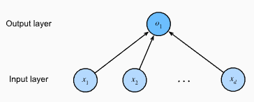

## Linear Regression as a Neural Network
In deep learning, we can view Linear Regression as the simplest possible neural network: **a single-layer fully connected network**.

**1. The Network Structure**

Imagine a diagram where every input feature is a "node" (neuron) that connects directly to the output.
- **Input Layer**: These are your features ($x_1, x_2, \ldots, x_d$). The number of inputs $d$ is called the dimensionality.
- **Output Layer**: This is the single neuron ($o_1$) that produces our prediction.
- **Connectivity**: Every input is connected to the output. These connections represent the weights.

**2. The Formula (Neural Perspective)**

The way a neuron computes a result is exactly like our linear regression formula:

$$o_1 = w_1 x_1 + w_2 x_2 + \dots + w_d x_d + b$$

**Detailed Formula Breakdown**:
- $x_i$ **(Inputs)**: The data being fed into the neuron.
- $w_i$ **(Weights)**: The strength of the connection. In biology, this is like a synapse determining how much a signal influences the next cell.
- $b$ **(Bias)**: An internal offset that allows the neuron to fire even when inputs are low.
- $o_1$ **(Output)**: The final weighted sum sent to the next part of the system.

**3. The Biological Inspiration**

The concept of artificial neural networks was inspired by how biological neurons function in the brain

| Artificial Component | Biological Equivalent | Function |
|----------------------|----------------------|----------|
| Input (xᵢ)           | Dendrites            | Receives signals from other neurons or sensors |
| Weights (wᵢ)         | Synapses             | Determines the strength or impact of the incoming signal |
| Summation + Bias     | Cell Nucleus         | Aggregates all incoming signals into one value |
| Output (o₁)          | Axon                 | Sends the processed signal to muscles or other neurons |

**Summary for your Study Material**

While modern deep learning has moved far beyond simple biology (using math and statistics to fly like an airplane rather than flap like a bird), the Linear Regression model remains the "atom" of these systems. It represents a single neuron making a single decision based on weighted evidence.